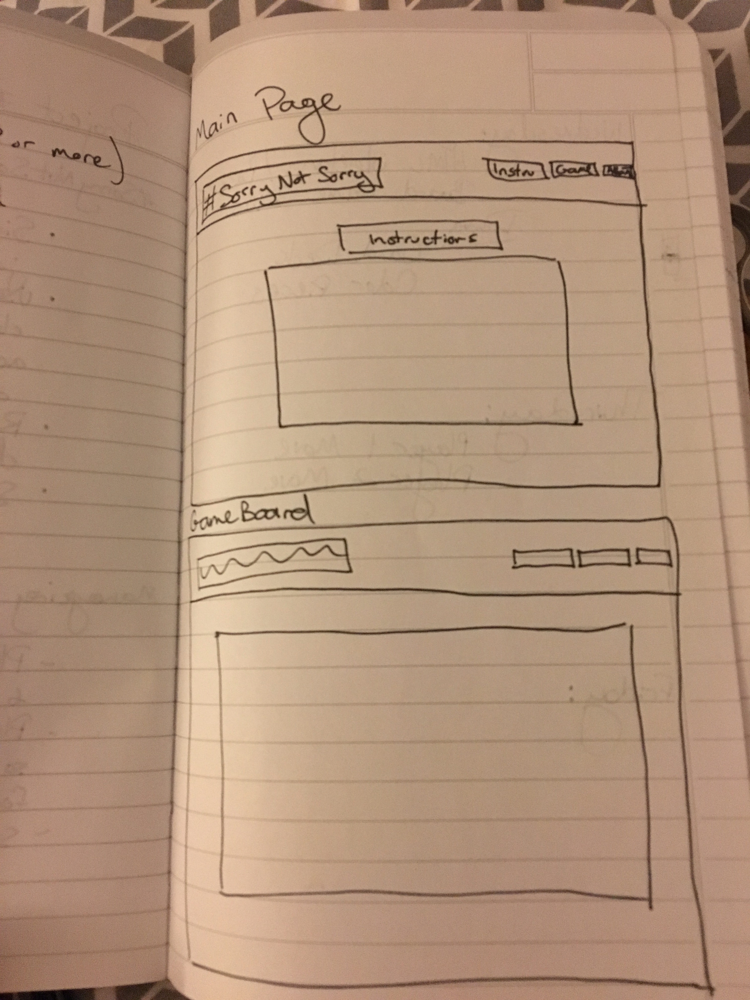

# SorryNotSorry

[Go play #SorryNotSorry](https://sincerelykristi.github.io/sorrynotsorry/)

**User Story:** This game targets our delight in nostalgia as well as our innundation with current culture, which today is often dictated by the internet and memes or fads that arise there. #SorryNotSorry's user is likely a Millenial or Gen Xer who is looking to kill time on the internet with a fun game that is familiar and comforting but also new and timely.

**MVP:** The MVP of this game will be a board that 8 pieces (or pegs), 4 for the user and 4 for the computer opponent, travel around. The first of the two different players (user and computer) to make all 4 of their pegs to the finish will win. 

*I was able to go one step beyond my MVP and include testing for if a peg lands where an opposing peg is currently, it will send that peg home to start over, adding some strategy for the user.*

**Wireframes:**

